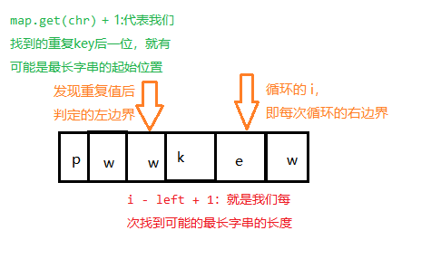

给定一个字符串，请你找出其中不含有重复字符的 最长子串 的长度。

 

示例 1:

输入: s = "abcabcbb"
输出: 3
解释: 因为无重复字符的最长子串是 "abc"，所以其长度为 3。
示例 2:

输入: s = "bbbbb"
输出: 1
解释: 因为无重复字符的最长子串是 "b"，所以其长度为 1。
示例 3:

输入: s = "pwwkew"
输出: 3
解释: 因为无重复字符的最长子串是 "wke"，所以其长度为 3。
请注意，你的答案必须是 子串 的长度，"pwke" 是一个子序列，不是子串。
示例 4:

输入: s = ""
输出: 0


提示：

0 <= s.length <= 5 * 104
s 由英文字母、数字、符号和空格组成

来源：力扣（LeetCode）
链接：https://leetcode-cn.com/problems/longest-substring-without-repeating-characters
著作权归领扣网络所有。商业转载请联系官方授权，非商业转载请注明出处。


解法1：使用HashMap



**注意**：i 自加轮循，左边界只在有重复key的时候比较。循环的 i 就是每次的右边界。

```java
public static int lengthOfLongestSubstring(String s) {
        int left = 0, n = s.length(), res = 0;
        Map<Character, Integer> map = new HashMap<>();
        for (int i = 0; i < n; ++i) {
            char chr = s.charAt(i);
            if (map.containsKey(chr)) {
                //更新左边界：比较原先的左边界 和 此刻i下的字符在map中对应的索引的后一位
                left = Math.max(left, map.get(chr) + 1);
            }
            map.put(chr, i);
            res = Math.max(res, i - left + 1);
        }
        return res;
    }
```

解法2：使用HashSet：在左指针向右移动的时候，我们从哈希集合中移除一个字符，在右指针向右移动的时候，我们往哈希集合中添加一个字符。

```java
public static int lengthOfLongestSubstring(String s) {
        Set<Character> set = new HashSet<>();
        // 右指针，初始值为 -1，相当于我们在字符串的左边界的左侧，还没有开始移动
        int pointer = -1, res = 0;
        for (int i = 0; i < s.length(); i++) {
            if (i != 0) {
                // 左指针向右移动一格，移除一个字符
                set.remove(s.charAt(i - 1));
            }
            // 指针小于字符的长度 且 set集合不包含指针右移一位的值
            while (pointer + 1 < s.length() && !set.contains(s.charAt(pointer + 1))) {
                // 不断地移动右指针
                set.add(s.charAt(pointer + 1));
                ++pointer;
            }
            res = Math.max(res, pointer - i + 1);
        }
        return res;
    }
```